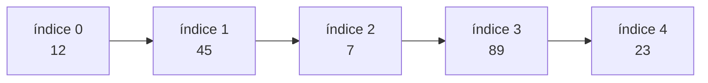
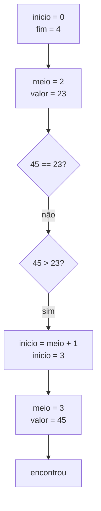
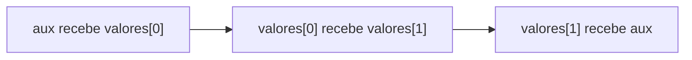
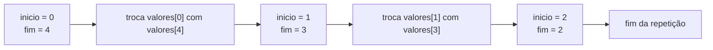

 

# Raciocínio Lógico Algorítmico: Aula 10
Orientador: Prof. Me Ricardo Carubbi

## Técnicas com arrays ou vetores

### Objetivo da aula
Compreender e implementar técnicas clássicas com **vetores** em JavaScript: **busca linear**, **busca binária** e **ordenação pelo método da bolha**. Ao final da aula, o aluno deverá ser capaz de percorrer um vetor para localizar valores, entender a condição necessária para usar busca binária e ordenar um vetor usando comparações e trocas entre posições vizinhas.

Esta aula continua o estudo de vetores iniciado na aula anterior. O foco agora não é apenas armazenar dados, mas aplicar **algoritmos** sobre uma sequência de valores.

## 1. Roteiro da aula

Nesta aula, vamos sair do uso básico de vetores e começar a aplicar técnicas clássicas sobre uma sequência de valores.

O tema parece simples porque os exemplos usam vetores pequenos, mas ele introduz ideias importantes:

- diferença entre **dado armazenado** e **algoritmo aplicado ao dado**;
- controle de índices;
- condição de parada;
- comparação entre elementos;
- troca de valores;
- relação entre ordenação e busca binária.

Uma ideia central desta aula é a seguinte:

> Nem toda técnica pode ser usada em qualquer vetor.

Por exemplo, a busca binária só funciona corretamente quando o vetor está **ordenado**.

Nesta aula, vamos trabalhar com três técnicas:

- a busca linear funciona em vetor ordenado ou desordenado;
- a busca binária exige vetor ordenado;
- o método da bolha é uma primeira forma de ordenar um vetor;
- o método da bolha ajuda a entender ordenação, mas não é eficiente para grandes quantidades de dados.

O objetivo principal não é memorizar códigos prontos, mas entender como usar:

- índices;
- variáveis auxiliares;
- vetores;
- comparações;
- trocas de valores.

### Padrão de entrada desta aula

Nos exemplos desta aula, a entrada será feita com dados separados por espaço.

Exemplo:

```text
12 45 7 89 23
```

Depois da leitura, usamos:

```javascript
linha = prompt("Digite os dados separados por espaco:");
dados = linha.split(" ");
```

Quando o exemplo envolver busca linear, usaremos uma convenção:

> O último número digitado será o valor procurado. Os números anteriores formarão o vetor.

Exemplo:

```text
12 45 7 89 23 7
```

Nesse caso:

- vetor: `[12, 45, 7, 89, 23]`;
- valor procurado: `7`.

Quando o exemplo envolver busca binária, usaremos dois `prompt`:

- o primeiro para digitar os valores do vetor;
- o segundo para digitar o `alvo`, isto é, o valor procurado.

### Convenção de nomes nos exemplos

Para manter os códigos curtos e legíveis, usaremos nomes de variáveis simples. Quando o nome tiver mais de uma palavra, usaremos **camelCase**.

| Variável | Significado |
| --- | --- |
| `linha` | texto digitado pelo usuário em uma única entrada |
| `dados` | dados separados depois do `split(" ")` |
| `valores` | vetor com os números que serão processados nos exemplos gerais |
| `vetor` | vetor usado nos exemplos de busca binária |
| `valorBusca` | valor procurado nos exemplos de busca linear |
| `alvo` | valor procurado nos exemplos de busca binária |
| `achou` | indica se o valor foi encontrado |
| `pos` | posição em que o valor foi encontrado |
| `aux` | variável auxiliar usada na troca de valores |

## 2. O problema da busca

Buscar significa verificar se um valor está presente em uma coleção de dados.

Exemplo:

```javascript
let valores;

valores = [12, 45, 7, 89, 23];
```

Perguntas possíveis:

- o valor `89` existe no vetor?
- em qual índice está o valor `7`?
- quantas comparações foram necessárias até encontrar o valor?
- o valor procurado não existe?

Essas perguntas aparecem em muitos problemas reais:

- procurar o código de um produto em uma lista;
- verificar se uma matrícula existe;
- encontrar uma temperatura específica em uma sequência de medições;
- localizar uma nota dentro de um conjunto de notas;
- verificar se um número já foi sorteado.

## 3. Busca linear

A **busca linear** percorre o vetor do início ao fim, verificando um elemento por vez.

Ela é chamada de linear porque segue a ordem natural dos índices:

```text
0, 1, 2, 3, 4, ...
```

### Ideia principal

Para cada posição do vetor:

1. acessar o elemento;
2. comparar com o valor procurado;
3. marcar que encontrou, caso os valores sejam iguais;
4. continuar ou encerrar a busca.

### Representação visual



Se o valor procurado for `89`, a busca compara:

| Comparação | Índice testado | Valor no vetor | Encontrou? |
| --- | --- | --- | --- |
| 1 | 0 | 12 | não |
| 2 | 1 | 45 | não |
| 3 | 2 | 7 | não |
| 4 | 3 | 89 | sim |

## 4. Exemplo de busca linear

Neste exemplo, a busca linear percorre o vetor até encontrar o valor procurado ou até acabar o vetor.

Quando o valor é encontrado, o algoritmo guarda a posição em que ele apareceu e encerra a busca.

```javascript
let linha;
let dados;
let valores;
let valorBusca;
let pos;
let i;

// Entrada
linha = prompt("Digite os valores e o valor procurado, separados por espaco:");

// Processamento: separa a linha em itens textuais
dados = linha.split(" ");

// Inicialização
valores = [];
pos = -1;

// O último valor da linha será o valor procurado
valorBusca = parseInt(dados[dados.length - 1]);

// Conversão dos dados textuais para números
for (i = 0; i < dados.length - 1; i++) {
    valores[i] = parseInt(dados[i]);
}

// Busca linear com for e parada antecipada
for (i = 0; i < valores.length; i++) {
    if (valores[i] === valorBusca) {
        pos = i;
        break;
    }
}

// Saída
if (pos !== -1) {
    console.log("Valor encontrado no indice " + pos);
    console.log("Ordem de entrada: " + (pos + 1));
} else {
    console.log("Valor nao encontrado");
}
```

### Por que usar `-1`?

O índice `-1` não é uma posição válida em um vetor comum percorrido com índices de `0` até `length - 1`.

Por isso, usamos `-1` para representar a ideia de **não encontrado**.

### Observação

O comando `break` encerra o laço assim que o valor procurado é encontrado.

Isso evita percorrer o restante do vetor sem necessidade.

Essa versão é adequada quando queremos encontrar apenas a primeira ocorrência.

### Variação com função

Também podemos separar a busca linear em uma função.

Essa organização deixa o código mais modular: a função recebe o vetor e o valor procurado, realiza a busca e devolve a posição encontrada.

```javascript
function buscaLinear(valores, valorBusca) {
    let i;
    let pos;

    pos = -1;

    for (i = 0; i < valores.length; i++) {
        if (valores[i] === valorBusca) {
            pos = i;
            break;
        }
    }

    return pos;
}
```

Uso da função:

```javascript
pos = buscaLinear(valores, valorBusca);
```

Se a função encontrar o valor, retorna o índice da primeira ocorrência. Se não encontrar, retorna `-1`.

### Ponto de atenção

Se o valor aparecer mais de uma vez, esse algoritmo guarda a primeira posição encontrada.

Exemplo:

```text
10 20 30 20 40 20
```

Nesse caso, o vetor é `[10, 20, 30, 20, 40]` e o valor procurado é `20`.

O algoritmo terminará com `pos = 1`, porque a primeira ocorrência de `20` está no índice `1`.

## 5. Quando a busca linear é adequada?

A busca linear é adequada quando:

- o vetor está desordenado;
- o vetor é pequeno;
- não vale a pena ordenar antes de buscar;
- a busca será feita poucas vezes;
- queremos uma solução simples e fácil de verificar.

Ela tem uma vantagem importante: funciona mesmo sem nenhuma preparação anterior do vetor.

### Limite da busca linear

No pior caso, a busca linear precisa verificar todos os elementos.

Isso acontece quando:

- o valor procurado está na última posição;
- o valor procurado não existe no vetor.

## 6. Busca binária

A **busca binária** é uma técnica mais eficiente de busca, mas possui uma condição obrigatória:

> O vetor precisa estar ordenado.

Se o vetor não estiver ordenado, a busca binária pode descartar a metade errada e produzir uma resposta incorreta.

### Ideia principal

Em vez de testar um elemento por vez desde o início, a busca binária testa o elemento do meio.

Se o valor procurado for menor que o valor do meio, a busca continua na metade esquerda.

Se o valor procurado for maior que o valor do meio, a busca continua na metade direita.

Se for igual, o valor foi encontrado.

### Exemplo

Vetor ordenado:

```text
[7, 12, 23, 45, 89]
```

Valor procurado:

```text
45
```

| Passo | Início | Fim | Meio | Valor no meio | Decisão |
| --- | --- | --- | --- | --- | --- |
| 1 | 0 | 4 | 2 | 23 | procurar à direita |
| 2 | 3 | 4 | 3 | 45 | encontrou |

### Representação visual



## 7. Implementação da busca binária

Neste exemplo, a busca binária trabalha com um vetor já ordenado.

A cada repetição, o algoritmo calcula o índice do meio da região pesquisada e decide se deve continuar pela metade esquerda ou pela metade direita.

```javascript
let linha;
let dados;
let vetor;
let alvo;
let inicio;
let fim;
let meio;
let pos;
let i;

// Entrada do vetor ordenado
linha = prompt("Digite os valores ordenados, separados por espaco:");

// Entrada do valor procurado
alvo = parseInt(prompt("Digite o valor procurado:"));

// Processamento: separa a linha em itens textuais
dados = linha.split(" ");

// Inicialização do vetor
vetor = [];

// Conversão dos dados textuais para números
for (i = 0; i < dados.length; i++) {
    vetor[i] = parseInt(dados[i]);
}

// Inicialização da busca binária
inicio = 0;
fim = vetor.length - 1;
pos = -1;

// Busca binária
while (inicio <= fim) {
    meio = parseInt((inicio + fim) / 2);

    if (alvo === vetor[meio]) {
        pos = meio;
        break;
    } else if (alvo > vetor[meio]) {
        inicio = meio + 1;
    } else {
        fim = meio - 1;
    }
}

// Saída
if (pos !== -1) {
    console.log("Valor encontrado no indice " + pos);
} else {
    console.log("Valor nao encontrado");
}
```

### Variação com função

Também podemos separar a busca binária em uma função.

Essa organização deixa o código mais modular: a função recebe o vetor ordenado e o valor procurado, realiza a busca e devolve a posição encontrada.

```javascript
function buscaBinaria(vetor, alvo) {
    let inicio;
    let fim;
    let meio;

    inicio = 0;
    fim = vetor.length - 1;

    while (inicio <= fim) {
        meio = parseInt((inicio + fim) / 2);

        if (alvo === vetor[meio]) {
            return meio;
        } else if (alvo > vetor[meio]) {
            inicio = meio + 1;
        } else {
            fim = meio - 1;
        }
    }

    return -1;
}
```

Uso da função:

```javascript
pos = buscaBinaria(vetor, alvo);
```

Se a função encontrar o valor, retorna o índice em que ele aparece no vetor ordenado. Se não encontrar, retorna `-1`.

### Explicação das variáveis

| Variável | Papel no algoritmo |
| --- | --- |
| `vetor` | vetor ordenado em que a busca será realizada |
| `alvo` | valor procurado no vetor |
| `inicio` | primeiro índice da região ainda pesquisada |
| `fim` | último índice da região ainda pesquisada |
| `meio` | índice central entre `inicio` e `fim` |
| `pos` | posição encontrada ou `-1` quando não encontrou |

### Ponto de atenção

A busca binária não deve ser usada em vetor desordenado.

Exemplo problemático:

```text
[12, 45, 7, 89, 23]
```

Esse vetor não possui ordem crescente. Se aplicarmos busca binária nele, o algoritmo pode ignorar exatamente a parte onde o valor procurado está.

### Observação sobre o cálculo do meio

Nesta aula, não usamos `Math.floor` nem outra biblioteca para calcular o meio.

Usamos:

```javascript
meio = parseInt((inicio + fim) / 2);
```

Nesse caso, `parseInt` transforma o resultado da divisão em um número inteiro, permitindo usar esse valor como índice do vetor.

### Visualização da busca binária

Para observar o funcionamento da busca binária passo a passo, acesse:

- Visualize DSA - Binary Search: https://visualizedsa.com/visualizers/binary-search
- Pearson - Binary Search Animation: https://liveexample.pearsoncmg.com/dsanimation13ejava/BinarySearcheBook.html

Use esses recursos para observar como os índices `inicio`, `fim` e `meio` mudam a cada repetição.

## 8. Comparando busca linear e busca binária

| Critério | Busca linear | Busca binária |
| --- | --- | --- |
| Exige vetor ordenado? | não | sim |
| Estratégia | testa um por um | divide a área de busca pela metade |
| Mais simples de implementar? | sim | não |
| Boa para vetor pequeno? | sim | sim |
| Boa para muitas buscas em vetor grande? | menos adequada | mais adequada, se o vetor estiver ordenado |

### Como estudar

No início, a busca linear deve ser dominada primeiro. Ela reforça o percurso de vetor e o uso de índices.

A busca binária deve entrar depois, como exemplo de algoritmo que usa uma ideia mais forte: **reduzir o problema a cada repetição**.

## 9. O problema da ordenação

Ordenar significa reorganizar os elementos de um vetor segundo algum critério.

Nesta aula, usaremos ordem crescente.

Exemplo:

```text
Antes:  [12, 45, 7, 89, 23]
Depois: [7, 12, 23, 45, 89]
```

Ordenar é importante porque:

- facilita a visualização dos dados;
- permite encontrar menores e maiores com mais facilidade;
- prepara o vetor para a busca binária;
- aparece em muitos problemas clássicos de programação.

## 10. Troca de valores entre posições

Antes de estudar o método da bolha, precisamos revisar a troca de valores.

Suponha o vetor:

```javascript
let valores;

valores = [12, 7];
```

Queremos trocar `valores[0]` com `valores[1]`.

Não podemos simplesmente fazer:

```javascript
valores[0] = valores[1];
valores[1] = valores[0];
```

Esse código perde o valor original de `valores[0]`.

A solução correta usa uma variável auxiliar chamada `aux`:

```javascript
let valores;
let aux;

valores = [12, 7];

aux = valores[0];
valores[0] = valores[1];
valores[1] = aux;

console.log(valores[0]); // 7
console.log(valores[1]); // 12
```

### Representação da troca



## 11. Revertendo um vetor

Reverter um vetor significa inverter a ordem dos elementos.

Exemplo:

```text
Antes:  [12, 45, 7, 89, 23]
Depois: [23, 89, 7, 45, 12]
```

Para fazer isso, trocamos:

- o primeiro elemento com o último;
- o segundo elemento com o penúltimo;
- o terceiro elemento com o antepenúltimo;
- e assim por diante.

### Ideia principal

Usaremos dois índices:

- `inicio`, começando no primeiro índice do vetor;
- `fim`, começando no último índice do vetor.

A cada repetição:

1. trocar `valores[inicio]` com `valores[fim]`;
2. aumentar `inicio`;
3. diminuir `fim`;
4. parar quando `inicio` não for mais menor que `fim`.

### Exemplo de reversão

```javascript
let linha;
let dados;
let valores;
let inicio;
let fim;
let aux;
let i;

// Entrada
linha = prompt("Digite os valores separados por espaco:");

// Processamento: separa a linha em itens textuais
dados = linha.split(" ");

// Inicialização do vetor
valores = [];

// Conversão dos dados textuais para números
for (i = 0; i < dados.length; i++) {
    valores[i] = parseInt(dados[i]);
}

// Inicialização dos índices
inicio = 0;
fim = valores.length - 1;

// Reversão do vetor
while (inicio < fim) {
    aux = valores[inicio];
    valores[inicio] = valores[fim];
    valores[fim] = aux;

    inicio++;
    fim--;
}

// Saída
for (i = 0; i < valores.length; i++) {
    console.log(valores[i]);
}
```

### Representação visual



### Ponto de atenção

A condição correta é:

```javascript
inicio < fim
```

Quando `inicio` e `fim` chegam na mesma posição, não há mais troca necessária. Isso acontece em vetores com quantidade ímpar de elementos, porque o elemento do meio permanece no mesmo lugar.

### Variação com desestruturação

JavaScript também permite trocar dois valores usando **atribuição por desestruturação**.

Essa forma de troca por desestruturação é mais curta, mas esconde a variável auxiliar. Por isso, ela deve ser vista como uma variação depois que a troca com `aux` já estiver entendida.

```javascript
let valores;
let inicio;
let fim;

valores = [12, 45, 7, 89, 23];

inicio = 0;
fim = valores.length - 1;

while (inicio < fim) {
    [valores[inicio], valores[fim]] = [valores[fim], valores[inicio]];

    inicio++;
    fim--;
}

for (let i = 0; i < valores.length; i++) {
    console.log(valores[i]);
}
```

O resultado será:

```text
23
89
7
45
12
```

## 12. Método da bolha

O **método da bolha**, também chamado de **bubble sort**, ordena um vetor comparando elementos vizinhos.

Se dois elementos vizinhos estiverem fora de ordem, eles são trocados.

### Ideia principal

Em ordem crescente:

- comparar `valores[i]` com `valores[i + 1]`;
- se `valores[i] > valores[i + 1]`, trocar os dois;
- repetir esse processo várias vezes.

A cada passagem completa pelo vetor, um dos maiores valores tende a ir para o final.

## 13. Exemplo manual do método da bolha

Vetor inicial:

```text
[12, 45, 7, 89, 23]
```

### Primeira passagem

| Comparação | Par comparado | Precisa trocar? | Vetor após a comparação |
| --- | --- | --- | --- |
| 1 | 12 e 45 | não | `[12, 45, 7, 89, 23]` |
| 2 | 45 e 7 | sim | `[12, 7, 45, 89, 23]` |
| 3 | 45 e 89 | não | `[12, 7, 45, 89, 23]` |
| 4 | 89 e 23 | sim | `[12, 7, 45, 23, 89]` |

Ao final da primeira passagem, o maior valor, `89`, ficou na última posição.

### Segunda passagem

| Comparação | Par comparado | Precisa trocar? | Vetor após a comparação |
| --- | --- | --- | --- |
| 1 | 12 e 7 | sim | `[7, 12, 45, 23, 89]` |
| 2 | 12 e 45 | não | `[7, 12, 45, 23, 89]` |
| 3 | 45 e 23 | sim | `[7, 12, 23, 45, 89]` |

Depois de novas passagens, o vetor permanece ordenado:

```text
[7, 12, 23, 45, 89]
```

## 14. Implementação do método da bolha

```javascript
let linha;
let dados;
let valores;
let i;
let j;
let aux;

// Entrada
linha = prompt("Digite os valores separados por espaco:");

// Processamento: separa a linha em itens textuais
dados = linha.split(" ");

// Inicialização do vetor
valores = [];

// Conversão dos dados textuais para números
for (i = 0; i < dados.length; i++) {
    valores[i] = parseInt(dados[i]);
}

// Ordenação pelo método da bolha
for (i = 0; i < valores.length - 1; i++) {
    for (j = 0; j < valores.length - 1 - i; j++) {
        if (valores[j] > valores[j + 1]) {
            aux = valores[j];
            valores[j] = valores[j + 1];
            valores[j + 1] = aux;
        }
    }
}

// Saída
for (i = 0; i < valores.length; i++) {
    console.log(valores[i]);
}
```

### Explicação dos laços

| Laço | Função |
| --- | --- |
| `for (i = 0; i < valores.length - 1; i++)` | controla quantas passagens serão feitas |
| `for (j = 0; j < valores.length - 1 - i; j++)` | compara pares vizinhos dentro de cada passagem |

### Por que usar `valores.length - 1 - i`?

Após cada passagem, o maior valor daquela região já está no final. Então não precisamos comparar novamente as últimas posições que já estão corretas.

Exemplo:

```text
Passagem 1: maior valor vai para o último índice
Passagem 2: segundo maior valor vai para o penúltimo índice
Passagem 3: terceiro maior valor vai para o antepenúltimo índice
```

Essa pequena melhoria evita comparações desnecessárias, mas mantém a ideia do método da bolha.

## 15. Método da bolha com exibição das passagens

Para entender melhor o processo, podemos exibir o vetor após cada passagem.

```javascript
let valores;
let i;
let j;
let aux;

valores = [12, 45, 7, 89, 23];

for (i = 0; i < valores.length - 1; i++) {
    for (j = 0; j < valores.length - 1 - i; j++) {
        if (valores[j] > valores[j + 1]) {
            aux = valores[j];
            valores[j] = valores[j + 1];
            valores[j + 1] = aux;
        }
    }

    console.log("Depois da passagem " + (i + 1) + ":");

    for (j = 0; j < valores.length; j++) {
        console.log(valores[j]);
    }
}
```

### Observação

Essa versão não é a mais curta, mas ajuda o aluno a enxergar o comportamento do algoritmo.

No começo, ver o vetor mudando depois de cada passagem costuma ser mais importante do que apenas receber o resultado final ordenado.

## 16. Ordenar e depois buscar

Agora podemos conectar as duas ideias:

1. ler um vetor;
2. ordenar o vetor pelo método da bolha;
3. aplicar busca binária no vetor ordenado.

```javascript
let linha;
let dados;
let vetor;
let alvo;
let i;
let j;
let aux;
let inicio;
let fim;
let meio;
let pos;

// Entrada do vetor
linha = prompt("Digite os valores separados por espaco:");

// Entrada do valor procurado
alvo = parseInt(prompt("Digite o valor procurado:"));

// Processamento: separa a linha em itens textuais
dados = linha.split(" ");

// Inicialização do vetor
vetor = [];

// Conversão dos dados textuais para números
for (i = 0; i < dados.length; i++) {
    vetor[i] = parseInt(dados[i]);
}

// Ordenação pelo método da bolha
for (i = 0; i < vetor.length - 1; i++) {
    for (j = 0; j < vetor.length - 1 - i; j++) {
        if (vetor[j] > vetor[j + 1]) {
            aux = vetor[j];
            vetor[j] = vetor[j + 1];
            vetor[j + 1] = aux;
        }
    }
}

// Busca binária no vetor ordenado
inicio = 0;
fim = vetor.length - 1;
pos = -1;

while (inicio <= fim) {
    meio = parseInt((inicio + fim) / 2);

    if (alvo === vetor[meio]) {
        pos = meio;
        break;
    } else if (alvo > vetor[meio]) {
        inicio = meio + 1;
    } else {
        fim = meio - 1;
    }
}

// Saída do vetor ordenado
console.log("Vetor ordenado:");

for (i = 0; i < vetor.length; i++) {
    console.log(vetor[i]);
}

// Saída da busca
if (pos !== -1) {
    console.log("Valor encontrado no indice " + pos + " do vetor ordenado");
} else {
    console.log("Valor nao encontrado");
}
```

### Ponto de atenção

Ao ordenar o vetor, as posições originais dos elementos podem mudar.

Exemplo:

```text
Antes:  [12, 45, 7, 89, 23]
Depois: [7, 12, 23, 45, 89]
```

O valor `45` estava no índice `1` antes da ordenação e passou para o índice `3` depois da ordenação.

Portanto, quando usamos busca binária após ordenar, a posição encontrada se refere ao **vetor ordenado**, não necessariamente à ordem original de entrada.

## 17. Busca linear ou ordenar e fazer busca binária?

Essa é uma decisão importante.

Se o objetivo é buscar apenas uma vez em um vetor pequeno, ordenar antes pode ser excesso de trabalho.

Exemplo:

```text
Vetor com 5 valores, uma única busca
```

Nesse caso, a busca linear é simples e suficiente.

Se o vetor é grande e serão feitas muitas buscas, organizar os dados antes pode compensar.

Exemplo:

```text
Vetor com 1000 valores, muitas buscas diferentes
```

Nesse caso, organizar os dados primeiro pode tornar as buscas posteriores mais eficientes.

Nesta aula, usamos o método da bolha para entender o funcionamento da ordenação. Em sistemas reais com muitos dados, normalmente são usados métodos de ordenação mais eficientes.

### Como decidir nesta aula

Para esta aula:

- use **busca linear** para reforçar percurso de vetor;
- use **busca binária** para entender divisão do problema;
- use o **método da bolha** para aprender comparação e troca;
- não trate o método da bolha como uma solução eficiente para sistemas reais grandes.

## 18. Erros comuns

1. Usar busca binária em vetor desordenado.
2. Esquecer que o primeiro índice do vetor é `0`.
3. Usar `i <= valores.length` e acessar uma posição inexistente.
4. Confundir `length` com último índice.
5. Esquecer a variável auxiliar `aux` na troca de valores.
6. Usar `inicio <= fim` na reversão e fazer uma troca desnecessária no elemento do meio.
7. Esquecer de atualizar `inicio++` e `fim--` ao reverter o vetor.
8. Comparar `valores[j]` com `valores[j + 1]` sem controlar corretamente o limite do laço.
9. Achar que o método da bolha faz apenas uma passagem.
10. Achar que a posição encontrada após ordenar é a posição original de entrada.
11. Usar `sort()` ou `reverse()` do JavaScript sem entender o algoritmo.
12. Esquecer de converter os valores de texto para número depois do `split`.
13. Esquecer que, nos exemplos de busca linear desta aula, o último valor da entrada é o valor procurado e não faz parte do vetor.

## 19. Exercícios em sala

### Exercício 1: busca linear

Leia vários números inteiros separados por espaço. O último número será o valor procurado. Informe se esse valor existe no vetor formado pelos números anteriores.

Exemplo de entrada:

```text
12 45 7 89 23 7
```

Saída esperada:

```text
Valor encontrado
```

### Exercício 2: busca linear com índice

Leia vários números inteiros separados por espaço. O último número será o valor procurado. Informe o índice em que esse número aparece pela primeira vez no vetor formado pelos números anteriores. Se não existir, exiba `Valor nao encontrado`.

Use o exemplo de busca linear apresentado na aula.

### Exercício 3: reversão de vetor

Leia vários números inteiros separados por espaço e exiba os valores na ordem inversa usando troca de posições.

Não use `reverse()`.

### Exercício 4: ordenação crescente

Leia vários números inteiros separados por espaço e exiba os valores em ordem crescente usando o método da bolha.

Não use `sort()`.

### Exercício 5: busca binária

Leia valores em ordem crescente. Depois, leia separadamente o alvo da busca. Use busca binária para informar se o alvo existe no vetor.

### Exercício 6: ordenar e buscar

Leia valores desordenados. Depois, leia separadamente o alvo da busca. Ordene o vetor usando o método da bolha e depois procure o alvo usando busca binária.

Ao final, exiba:

- o vetor ordenado;
- se o valor foi encontrado;
- o índice no vetor ordenado.

## 20. Fechamento

Nesta aula, você estudou técnicas clássicas com vetores:

- busca linear;
- busca binária;
- troca de valores usando a variável auxiliar `aux`;
- reversão de vetor;
- ordenação pelo método da bolha;
- relação entre vetor ordenado e busca binária.

A ideia mais importante da aula é que algoritmos não são apenas comandos decorados. Cada técnica depende de uma condição:

- busca linear funciona mesmo sem ordenação;
- busca binária exige vetor ordenado;
- reversão troca elementos das extremidades em direção ao centro;
- bolha ordena por comparações e trocas sucessivas.

Dominar essas técnicas ajuda a desenvolver raciocínio algorítmico e prepara o aluno para estruturas de dados e algoritmos mais avançados.

## 21. Observação sobre JavaScript

JavaScript possui métodos prontos, como:

```javascript
valores.sort();
valores.reverse();
valores.includes(10);
valores.indexOf(10);
```

Nesta aula, esses métodos não serão usados como solução principal.

O motivo é que queremos entender como a busca e a ordenação funcionam internamente.

Depois que o raciocínio estiver consolidado, métodos prontos podem ser usados de forma consciente. Antes disso, eles escondem justamente a parte que precisamos aprender.

## Saiba mais

- MDN - Array: https://developer.mozilla.org/pt-BR/docs/Web/JavaScript/Reference/Global_Objects/Array
- MDN - Array.prototype.sort(): https://developer.mozilla.org/pt-BR/docs/Web/JavaScript/Reference/Global_Objects/Array/sort
- Khan Academy - Binary search: https://www.khanacademy.org/computing/computer-science/algorithms/binary-search/a/binary-search