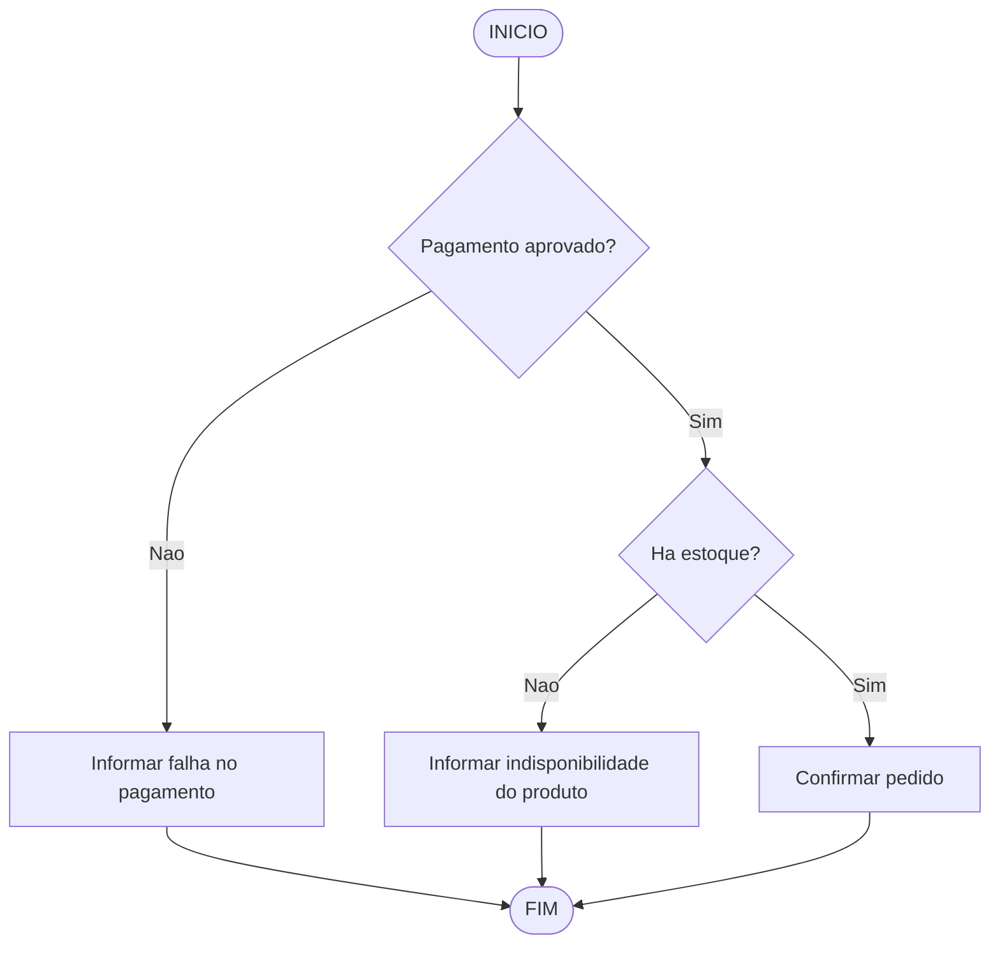
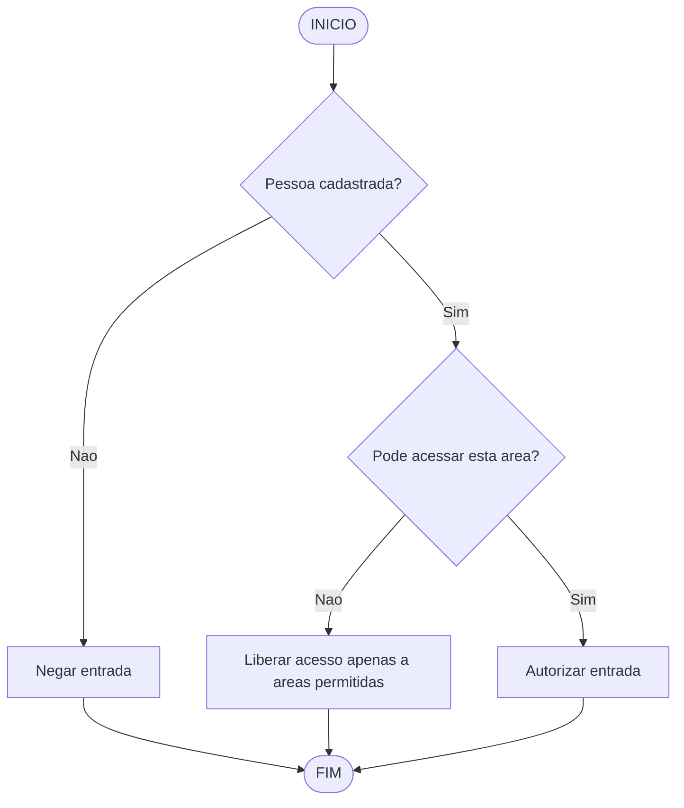
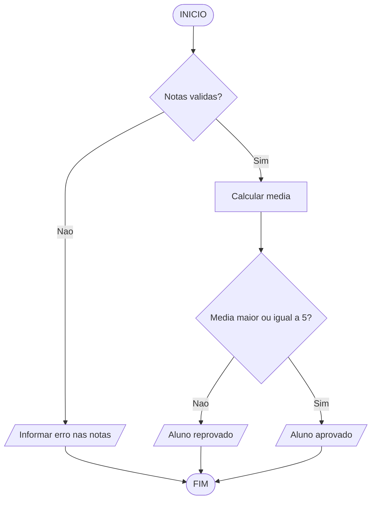

 

# Raciocínio Lógico Algorítmico: Aula 7
Orientador: Prof. Me Ricardo Carubbi

## Estruturas Condicionais Aninhadas

### Objetivo da aula
Compreender como organizar decisões dependentes em algoritmos por meio de estruturas condicionais aninhadas, aplicando sintaxe correta, raciocínio hierárquico e exemplos práticos em JavaScript.

### 1. Fundamentação teórica
Em muitos problemas computacionais, uma única decisão não é suficiente. Primeiro é preciso validar uma condição geral e, somente depois, avaliar uma condição mais específica. Esse tipo de situação é modelado com estruturas condicionais aninhadas.

Uma estrutura condicional aninhada ocorre quando um bloco `if` ou `else` contém outra estrutura condicional em seu interior. Essa organização cria uma hierarquia de decisões, em que a segunda verificação depende do resultado da primeira.

Esse recurso é importante quando:
- existe uma validação inicial antes do processamento;
- uma decisão só faz sentido após outra já ter sido confirmada;
- o algoritmo precisa tratar exceções antes de chegar ao caso principal;
- há regras compostas com mais de um nível de análise.

Em termos lógicos, a estrutura aninhada ajuda a separar:
- validação de entrada;
- processamento principal;
- tratamento de casos alternativos.

### 2. Como pensar em condicionais aninhadas
Uma condicional aninhada pode ser lida como uma sequência de perguntas:

1. A primeira condição é válida?
2. Se for válida, qual decisão específica deve ser tomada?
3. Se não for válida, qual mensagem ou tratamento deve ser aplicado?

Essa abordagem evita cálculos indevidos e torna o algoritmo mais seguro e mais fácil de interpretar.

### 3. Sintaxe básica
#### 3.1 Estrutura geral
```javascript
// Declaracao de variaveis
let condicao1;
let condicao2;
let mensagem;

// Entrada
condicao1 = prompt("Digite o valor logico da condicao 1 (true/false):"); // true
condicao2 = prompt("Digite o valor logico da condicao 2 (true/false):"); // false

// Processamento
if (condicao1 == "true") {
    if (condicao2 == "true") {
        mensagem = "condicao1 e condicao2 sao verdadeiras";
    } else {
        mensagem = "condicao1 e verdadeira, mas condicao2 e falsa";
    }
} else {
    mensagem = "condicao1 e falsa";
}

// Saida
console.log(mensagem);
```

#### 3.2 Forma equivalente com `if` dentro de `else`
```javascript
// Declaracao de variaveis
let condicao1;
let condicao2;
let mensagem;

// Entrada
condicao1 = prompt("Digite o valor logico da condicao 1 (true/false):"); // false
condicao2 = prompt("Digite o valor logico da condicao 2 (true/false):"); // true

// Processamento
if (condicao1 == "true") {
    mensagem = "acao 1";
} else {
    if (condicao2 == "true") {
        mensagem = "acao 2";
    } else {
        mensagem = "acao 3";
    }
}

// Saida
console.log(mensagem);
```

As duas formas representam decisões em níveis. O ponto principal não é a aparência, mas a dependência lógica entre as verificações.

### 4. Diferença entre composta e aninhada
Na estrutura composta, existe apenas uma decisão principal com dois caminhos:

```javascript
// Declaracao de variaveis
let condicao;
let mensagem;

// Entrada
condicao = prompt("Digite o valor logico da condicao (true/false):"); // true

// Processamento
if (condicao == "true") {
    mensagem = "caminho verdadeiro";
} else {
    mensagem = "caminho falso";
}

// Saida
console.log(mensagem);
```

Na estrutura aninhada, um dos caminhos contém uma nova decisão:

```javascript
// Declaracao de variaveis
let condicao1;
let condicao2;
let mensagem;

// Entrada
condicao1 = prompt("Digite o valor logico da condicao 1 (true/false):"); // true
condicao2 = prompt("Digite o valor logico da condicao 2 (true/false):"); // true

// Processamento
if (condicao1 == "true") {
    if (condicao2 == "true") {
        mensagem = "caminho mais especifico";
    } else {
        mensagem = "outro resultado especifico";
    }
} else {
    mensagem = "tratamento alternativo";
}

// Saida
console.log(mensagem);
```

Portanto, a estrutura aninhada é indicada quando há dependência entre decisões, e não apenas uma escolha binária simples.

### 5. Exemplo prático 1: média do aluno com validação de notas
Este exemplo foi baseado no material de `intro_cond.md`. A primeira decisão verifica se as notas são válidas. Somente depois disso a média é calculada e a situação do aluno é definida.

```javascript
// Declaracao de variaveis
let alunoNota1;
let alunoNota2;
let alunoMedia;
let situacaoAluno;
let mensagem;

// Entrada
alunoNota1 = prompt("Digite a nota 1 do aluno:"); // 7.0
alunoNota2 = prompt("Digite a nota 2 do aluno:"); // 4.0

// Processamento
alunoNota1 = parseFloat(alunoNota1);
alunoNota2 = parseFloat(alunoNota2);

if (alunoNota1 >= 0 && alunoNota2 >= 0) {
    alunoMedia = (alunoNota1 + alunoNota2) / 2;

    if (alunoMedia >= 5) {
        situacaoAluno = "aprovado!";
    } else {
        situacaoAluno = "reprovado!";
    }

    mensagem = `Media: ${alunoMedia}. O aluno esta ${situacaoAluno}`;
} else {
    mensagem = "A nota deve ser maior ou igual a zero!";
}

// Saida
console.log(mensagem);
```

#### Análise do exemplo
- a condição externa valida os dados de entrada;
- a condição interna decide a situação acadêmica;
- o cálculo da média só ocorre se as notas forem válidas.

Esse padrão é frequente em algoritmos: primeiro validar, depois decidir.

#### Observação
Neste exemplo, poderíamos pensar em escrever uma única condição como `alunoNota1 >= 0 && alunoNota2 >= 0 && alunoMedia >= 5`, mas essa não é a melhor escolha. O motivo é que `alunoMedia` só existe de forma adequada depois que as notas forem validadas e a média for calculada.

Por isso, a estrutura aninhada é mais apropriada quando a decisão acontece em etapas:
- primeiro validamos as notas;
- depois calculamos a média;
- por fim, verificamos se o aluno foi aprovado ou reprovado.

Em situações do cotidiano, esse tipo de organização também é comum. Por exemplo:
- em uma compra online, primeiro verifica-se se o pagamento foi aprovado; depois verifica-se se há estoque;
- no acesso a um prédio, primeiro verifica-se se a pessoa está cadastrada; depois verifica-se se ela pode entrar em determinada área;
- em um sistema acadêmico, primeiro verifica-se se as notas são válidas; depois define-se a situação do aluno.

**Compra online**



**Acesso a predio**



**Sistema academico**



Assim, expressões lógicas únicas são mais adequadas quando tudo pode ser decidido ao mesmo tempo. Já as estruturas aninhadas são melhores quando uma decisão depende da etapa anterior.

### 6. Exemplo prático 2: aptidão para tirar CNH
Este exemplo também foi reaproveitado de `intro_cond.md`. A idade é analisada em dois níveis: primeiro verifica-se se o valor é válido; depois verifica-se se a pessoa já atingiu a idade mínima.

```javascript
// Declaracao de variaveis
let idade;
let anosApto;
let mensagem;

// Entrada
idade = prompt("Digite a idade do candidato:"); // 18

// Processamento
idade = parseInt(idade);

if (idade < 0) {
    mensagem = "A idade deve ser maior ou igual a zero!";
} else {
    if (idade >= 18) {
        mensagem = "O candidato esta apto a tirar a CNH!";
    } else {
        anosApto = 18 - idade;
        mensagem = `Faltam ${anosApto} ano(s) para o candidato estar apto!`;
    }
}

// Saida
console.log(mensagem);
```

#### Análise do exemplo
- o primeiro teste evita uma entrada inválida;
- o segundo teste trata a regra principal do problema;
- o bloco final informa quanto tempo falta para a pessoa atingir a condição necessária.

### 7. Exemplo prático 3: versão ampliada com faixa de desempenho
Uma vantagem das estruturas aninhadas é permitir decisões progressivas. Abaixo, o mesmo contexto de notas é ampliado para classificar o desempenho do aluno.

```javascript
// Declaracao de variaveis
let nota1;
let nota2;
let media;
let resultado;

// Entrada
nota1 = prompt("Digite a nota 1:"); // 8.0
nota2 = prompt("Digite a nota 2:"); // 6.0

// Processamento
nota1 = parseFloat(nota1);
nota2 = parseFloat(nota2);

if (nota1 >= 0 && nota2 >= 0) {
    media = (nota1 + nota2) / 2;

    if (media >= 7) {
        resultado = "Aluno aprovado com bom desempenho.";
    } else {
        if (media >= 5) {
            resultado = "Aluno aprovado.";
        } else {
            resultado = "Aluno reprovado.";
        }
    }
} else {
    resultado = "Notas invalidas.";
}

// Saida
console.log(resultado);
```

Nesse caso:
- o primeiro nível valida as notas;
- o segundo nível verifica aprovação direta;
- o terceiro nível diferencia aprovação simples de reprovação.

### 8. Uso de `switch-case` em casos aninhados
Embora estruturas aninhadas sejam normalmente associadas ao `if`, também é possível aninhar decisões com `switch-case`. Isso é útil quando a decisão externa depende do valor exato de uma variável e, dentro de cada caso, ainda existe uma nova decisão.

Esse tipo de solução costuma ser apropriado quando:
- a variável principal possui valores bem definidos;
- cada caso representa um cenário diferente;
- dentro de um caso ainda é necessário validar uma condição adicional.

#### Exemplo prático: calculo de desconto por perfil
```javascript
// Declaracao de variaveis
let perfil;
let matriculaAtiva;
let valorCurso;
let valorFinal;
let mensagem;

// Entrada
perfil = prompt("Digite o perfil do usuario: "); // aluno
matriculaAtiva = prompt("A matricula esta ativa? (true/false): "); // true
valorCurso = prompt("Digite o valor do curso: "); // 1200 

// Processamento
valorCurso = parseFloat(valorCurso);

switch (perfil) {
    case "aluno":
        if (matriculaAtiva == "true") {
            valorFinal = valorCurso * 0.8;
        } else {
            valorFinal = valorCurso;
        }
        break;

    case "professor":
        valorFinal = valorCurso * 0.7;
        break;

    case "visitante":
        valorFinal = valorCurso * 1.0;
        break;

    default:
        valorFinal = -1;
}

// Saida
if (valorFinal == -1) {
    console.log("Perfil invalido.");
} else {
    console.log(`R$ ${valorFinal.toFixed(2)}`);
}
```

#### Análise do exemplo
- o `switch` decide com base no perfil;
- dentro do caso `"aluno"`, existe uma decisão aninhada com `if`;
- cada caminho realiza um calculo diferente sobre o valor do curso;
- isso mostra que `switch-case` e `if` podem ser combinados quando o problema possui níveis diferentes de decisão.

#### Exemplo com `switch` dentro de `if`
Também é possível fazer o contrário: primeiro validar uma condição geral e, depois, usar `switch-case` para tratar múltiplos casos.

```javascript
// Declaracao de variaveis
let usuarioAutenticado;
let opcaoMenu;
let nota1;
let nota2;
let resultado;
let mensagem;

// Entrada
usuarioAutenticado = prompt("Usuario autenticado? (true/false)"); // true
opcaoMenu = prompt("Digite a opcao do menu:"); // 2
nota1 = prompt("Digite a nota 1:"); // 8.0
nota2 = prompt("Digite a nota 2:"); // 6.0

// Processamento
opcaoMenu = parseInt(opcaoMenu);
nota1 = parseFloat(nota1);
nota2 = parseFloat(nota2);

if (usuarioAutenticado == "true") {
    switch (opcaoMenu) {
        case 1:
            resultado = nota1 + nota2;
            mensagem = `Soma: ${resultado}`;
            break;
        case 2:
            resultado = (nota1 + nota2) / 2;
            mensagem = `Media: ${resultado}`;
            break;
        case 3:
            resultado = nota1 > nota2 ? nota1 - nota2 : nota2 - nota1;
            mensagem = `Diferenca: ${resultado}`;
            break;
        default:
            mensagem = "Opcao invalida.";
    }
} else {
    mensagem = "Usuario nao autenticado.";
}

// Saida
console.log(mensagem);
```

Nesse caso:
- o `if` valida a condição principal;
- o `switch` trata os vários caminhos possíveis depois da validação;
- cada `case` executa um calculo diferente;
- a estrutura continua sendo aninhada, pois uma decisão está dentro da outra.

#### Exemplo prático: lanche com adicional no X-Bacon
Este exemplo é inspirado no problema `Lanche` do Beecrowd, mas foi adaptado para incluir uma decisão aninhada: se o item escolhido for `X-Bacon`, o algoritmo pergunta se o queijo sera `cheddar` ou `normal`. Se for `cheddar`, acrescenta `R$ 0,50` ao valor final.

```javascript
// Declaracao de variaveis
let codigo;
let quantidade;
let comCheddar;
let precoUnitario;
let valorTotal;
let mensagem;

// Entrada
codigo = prompt("Digite o codigo do item:"); // 3
quantidade = prompt("Digite a quantidade:"); // 2
comCheddar = prompt("Se for X-Bacon, deseja adicionar cheddar? (s/n)"); // s

// Processamento
codigo = parseInt(codigo);
quantidade = parseInt(quantidade);

if (codigo >= 1 && codigo <= 4) {
    witch (codigo) {
        case 1:
            precoUnitario = 4.0;
            break;
        case 2:
            precoUnitario = 4.5;
            break;
        case 3:
            precoUnitario = 5.0;
            if (comCheddar == "s") {
                precoUnitario = precoUnitario + 0.5;
            }
            break;
        case 4:
            precoUnitario = 2.0;
            break;
    }
} else {
    mensagem = "Codigo invalido";
}

// Saida
if (mensagem != "Codigo invalido") {
    valorTotal = precoUnitario * quantidade;
    mensagem = `Total: R$ ${valorTotal.toFixed(2)}`;
}
console.log(mensagem);
```

#### Análise do exemplo
- o `switch` escolhe o item do cardapio pelo codigo;
- no caso do `X-Bacon`, existe uma nova decisão com `if`;
- essa decisão aninhada altera o preco unitario antes do calculo final;
- esse é um bom exemplo de quando `switch-case` sozinho não basta, pois um dos casos exige uma regra adicional.

### 9. Boas práticas
- validar entradas antes de executar cálculos;
- manter a indentação correta para evidenciar os níveis da decisão;
- usar nomes de variáveis claros, como `media`, `situacaoAluno` e `idade`;
- evitar aninhamentos excessivos quando uma expressão lógica simples resolver o problema;
- testar casos de borda, como valores negativos, zero e limites exatos.

### 10. Erros comuns
- calcular resultados antes de validar os dados;
- esquecer chaves `{}` e comprometer o bloco correto;
- aninhar muitas decisões sem necessidade;
- repetir verificações que poderiam ser combinadas;
- usar variáveis com nomes inconsistentes.

Exemplo de atenção:
```javascript
// Declaracao de variaveis
let nota;
let mensagem;

// Entrada
nota = prompt("Digite a nota:"); // 8

// Processamento
nota = parseFloat(nota);

if (nota >= 0) {
    if (nota <= 10) {
        mensagem = "Nota valida";
    } else {
        mensagem = "Nota invalida";
    }
} else {
    mensagem = "Nota invalida";
}

// Saida
console.log(mensagem);
```

Esse código funciona, mas em alguns casos pode ser mais claro escrever:

```javascript
// Declaracao de variaveis
let nota;
let mensagem;

// Entrada
nota = prompt("Digite a nota:"); // 8

// Processamento
nota = parseFloat(nota);

if (nota >= 0 && nota <= 10) {
    mensagem = "Nota valida";
} else {
    mensagem = "Nota invalida";
}

// Saida
console.log(mensagem);
```

Ou seja, nem todo problema precisa de aninhamento. Ele deve ser usado quando houver dependência lógica entre etapas.

### 11. Fechamento
As estruturas condicionais aninhadas permitem representar decisões em camadas, o que é essencial em problemas reais com validação, regras e exceções. Em algoritmos, isso melhora a organização do raciocínio e reduz erros de processamento.

Nesta aula, vimos:
1. o conceito de estrutura condicional aninhada;
2. a sintaxe básica em JavaScript;
3. a diferença entre condicional composta e aninhada;
4. exemplos práticos com notas e idade;
5. o uso de `switch-case` em estruturas aninhadas;
6. boas práticas para escrever algoritmos mais claros.

### Referências bibliográficas
1. FORBELLONE, A. L. V. Lógica de Programação: a construção de algoritmos e estruturas de dados. Pearson Prentice Hall, 2005. Capítulo 3.

2. ASCENCIO, Ana Fernanda Gomes; CAMPOS, Edilene Aparecida Veneruchi de. Fundamentos da programação de computadores. Pearson Educación, 2008. Capítulo 4.

3. MANZANO, José Augusto N. G.; OLIVEIRA, Jayr Figueiredo de. Lógica para Desenvolvimento de Programação de Computadores. São Paulo: Érica, 2019. Capítulo 4.

4. MOZILLA DEVELOPER NETWORK. `if...else`. Disponível em: https://developer.mozilla.org/pt-BR/docs/Web/JavaScript/Reference/Statements/if...else. Acesso em: 13 mar. 2026.

5. MOZILLA DEVELOPER NETWORK. Operador lógico AND (`&&`). Disponível em: https://developer.mozilla.org/pt-BR/docs/Web/JavaScript/Reference/Operators/Logical_AND. Acesso em: 13 mar. 2026.

6. MOZILLA DEVELOPER NETWORK. Operador lógico OR (`||`). Disponível em: https://developer.mozilla.org/pt-BR/docs/Web/JavaScript/Reference/Operators/Logical_OR. Acesso em: 13 mar. 2026.

7. MOZILLA DEVELOPER NETWORK. Operador lógico NOT (`!`). Disponível em: https://developer.mozilla.org/pt-BR/docs/Web/JavaScript/Reference/Operators/Logical_NOT. Acesso em: 13 mar. 2026.

8. MOZILLA DEVELOPER NETWORK. `let`. Disponível em: https://developer.mozilla.org/pt-BR/docs/Web/JavaScript/Reference/Statements/let. Acesso em: 13 mar. 2026.
