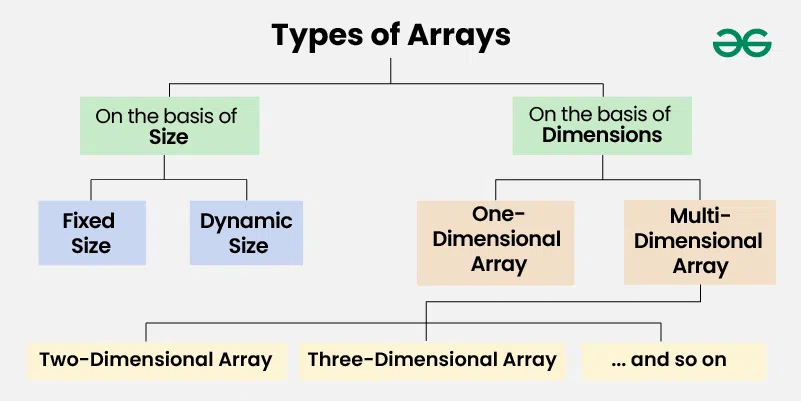
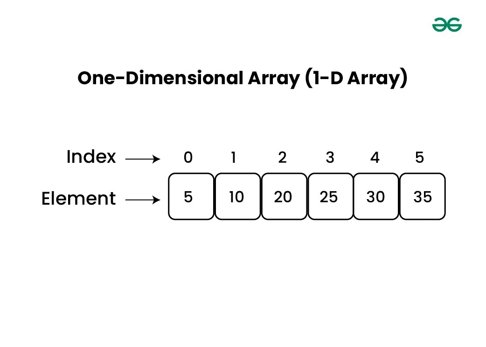
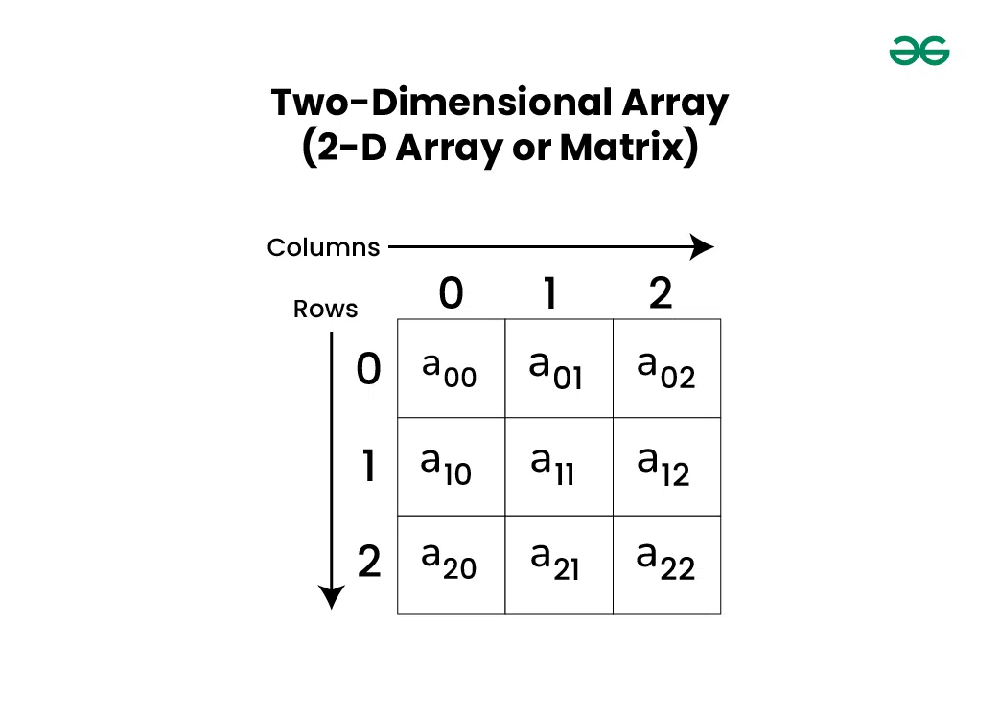
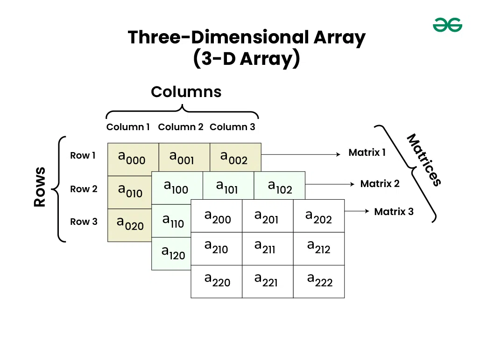
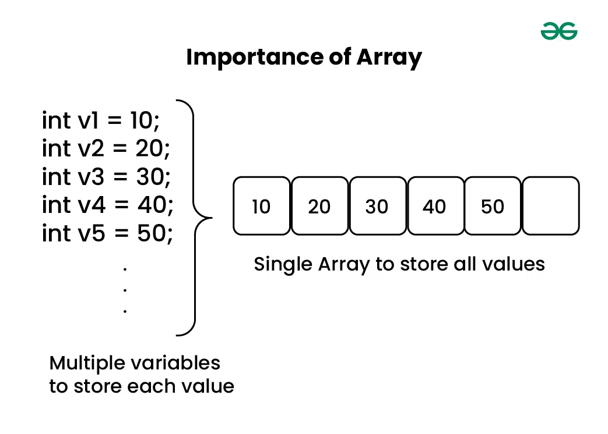
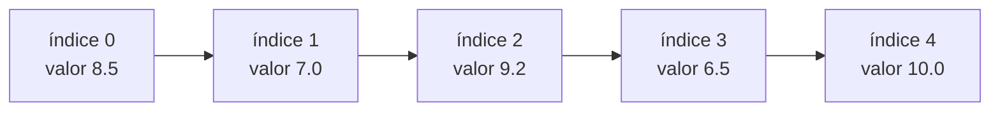
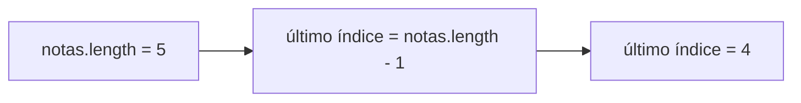
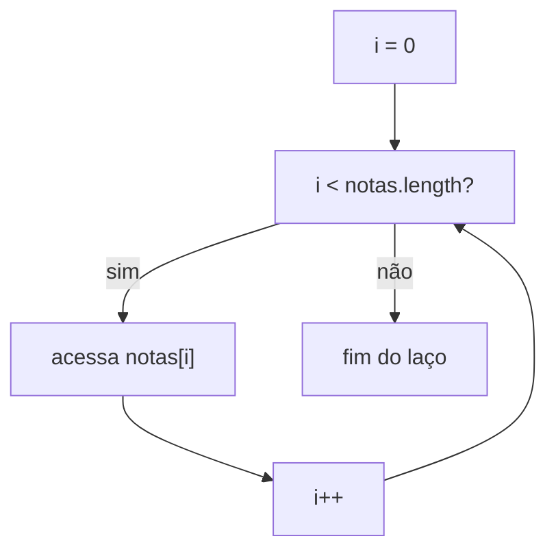
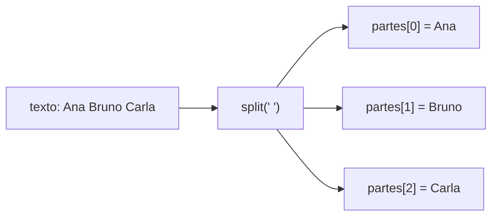
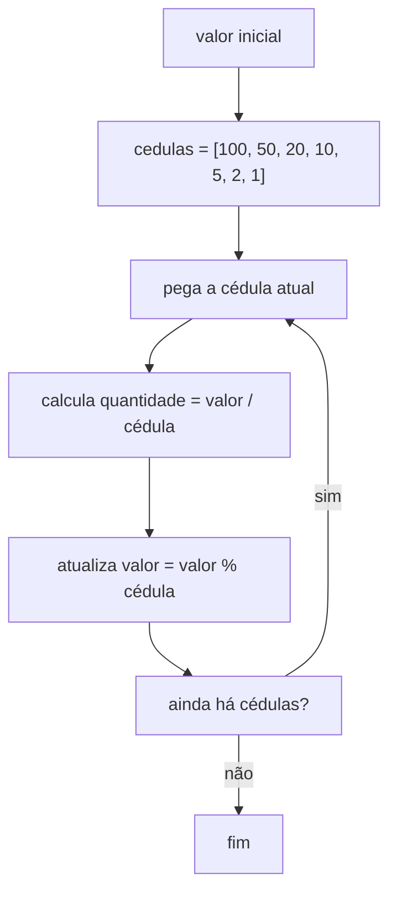

 

# Raciocínio Lógico Algorítmico: Aula 9
Orientador: Prof. Me Ricardo Carubbi

## Vetores em JavaScript

### Objetivo da aula
Compreender o uso de **arrays** como estruturas para armazenar vários valores em uma única variável, acessar elementos por **índice**, percorrer vetores com `for`, preencher vetores a partir de entradas do usuário e aplicar algoritmos clássicos como **soma**, **média**, **maior valor**, **busca** e **decomposição de valores usando arrays**.

Nesta aula, o foco será apenas em **vetores**. Matrizes serão estudadas na próxima aula.

## 1. Conceitos iniciais sobre arrays

Um **array** é uma estrutura usada para armazenar vários valores em uma única variável.


**Figura 9.1** - Ideia geral de array como estrutura para armazenar vários valores relacionados.

Existem diferentes formas de classificar arrays. Nesta aula, vamos usar duas classificações apenas para orientar o raciocínio:

- classificação pelo **tamanho**;
- classificação pela **quantidade de dimensões**.



**Figura 9.2** - Classificação geral dos arrays por tamanho e por quantidade de dimensões.

### 1.1 Arrays quanto ao tamanho

Quanto ao tamanho, podemos pensar em dois tipos principais.

#### Array de tamanho fixo

Um array de tamanho fixo possui uma quantidade de posições definida no momento da criação. Depois disso, essa quantidade de posições não muda.

Essa ideia aparece em linguagens como Java quando usamos arrays tradicionais.

Exemplo conceitual em Java:

```java
// Cria um array de inteiros com 6 posições
int[] numeroAlunosPorMes = new int[6];
```

Nesse exemplo, o array `numeroAlunosPorMes` possui seis posições, uma para cada mês observado. A quantidade de posições não aumenta automaticamente.

#### Array dinâmico

Um array dinâmico pode crescer durante a execução do programa.

Em JavaScript, essa é a forma mais comum de trabalhar com arrays. Podemos começar com um vetor vazio e preencher suas posições ao longo do algoritmo.

```javascript
let notas;

// Cria um array vazio
notas = [];

// Preenche posições específicas do array
notas[0] = 8.5;
notas[1] = 7.0;
notas[2] = 9.2;
```

Nesta aula, vamos trabalhar com esse modelo: arrays dinâmicos em JavaScript, preenchidos de forma explícita por índice.

### 1.2 Arrays quanto às dimensões

Quanto às dimensões, podemos pensar em arrays de uma ou mais dimensões.

#### Array de uma dimensão

Um array de uma dimensão também é chamado de **vetor**.


Ele pode ser imaginado como uma única linha de valores:



**Figura 9.3** - Representação de um array de uma dimensão, também chamado de vetor.

| Índice | 0 | 1 | 2 | 3 | 4 |
| --- | --- | --- | --- | --- | --- |
| Valor | 8.5 | 7.0 | 9.2 | 6.5 | 10.0 |

Nesta aula, estudaremos apenas arrays de uma dimensão, ou seja, **vetores**.

#### Array de mais de uma dimensão

Arrays com mais de uma dimensão permitem representar dados organizados em linhas, colunas ou estruturas mais complexas.

Um array de duas dimensões pode ser usado para representar uma tabela ou matriz.

Exemplo conceitual:



**Figura 9.4** - Representação de um array bidimensional, organizado em linhas e colunas.

| | Coluna 0 | Coluna 1 | Coluna 2 |
| --- | --- | --- | --- |
| Linha 0 | 1 | 2 | 3 |
| Linha 1 | 4 | 5 | 6 |

Também existem arrays com mais dimensões, como arrays tridimensionais.



**Figura 9.5** - Representação conceitual de um array tridimensional.

Matrizes serão estudadas na próxima aula. Nesta aula, elas aparecem apenas para mostrar que **vetor** é o primeiro caso de array que precisamos dominar.

## 2. Por que precisamos de arrays?

Até agora, quando precisávamos guardar poucos valores, criávamos uma variável para cada dado:

```javascript
// Cada variável guarda apenas uma nota
let nota1;
let nota2;
let nota3;
let nota4;
let nota5;
```

Essa solução funciona para poucos valores, mas fica ruim quando a quantidade aumenta. Se uma turma tiver 40 alunos, criar `nota1`, `nota2`, `nota3` até `nota40` torna o algoritmo repetitivo, difícil de ler e difícil de manter.

Um **array** resolve esse problema guardando vários valores sob um mesmo nome.



**Figura 9.6** - Uso de arrays para armazenar vários valores relacionados em uma única estrutura.

```javascript
let notas;

// Um único array guarda várias notas
notas = [8.5, 7.0, 9.2, 6.5, 10.0];
```

Nesse exemplo, `notas` é um vetor com cinco valores.

### Exemplos reais de uso

Arrays aparecem em muitos problemas reais porque vários sistemas precisam guardar e processar **sequências de dados**.

Exemplos simples:

- notas de alunos em uma turma;
- temperaturas medidas ao longo do dia;
- preços de produtos em uma loja;
- idades de pessoas entrevistadas em uma pesquisa;
- quantidade de acessos a um site em cada hora;
- valores de vendas em cada mês do ano;
- nomes de participantes de uma lista de presença.

Na **Ciência da Computação**, arrays são usados em situações como:

- armazenar os valores que serão pesquisados ou ordenados por um algoritmo;
- representar uma sequência de comandos, tokens ou caracteres de um texto;
- guardar amostras de dados para análise;
- armazenar resultados intermediários de cálculos;
- percorrer listas de entradas em testes automatizados;
- representar filas simples de dados em simulações iniciais.

Na **Engenharia da Computação**, arrays também são muito comuns. Alguns exemplos:

- armazenar leituras de sensores, como temperatura, luminosidade ou distância;
- guardar sinais digitais amostrados ao longo do tempo;
- representar valores lidos de portas de entrada de um microcontrolador;
- armazenar medições de corrente, tensão ou potência;
- registrar estados sucessivos de um sistema embarcado;
- manter uma sequência de comandos enviados a um dispositivo.

Por exemplo, um sistema embarcado poderia guardar várias leituras de temperatura em um vetor:

```javascript
let temperaturas;

temperaturas = [28.5, 29.0, 29.4, 30.1, 30.0];
```

Depois, o algoritmo poderia percorrer esse vetor para calcular a média, encontrar a maior temperatura ou verificar se algum valor ultrapassou um limite seguro.

### Ideia principal

Sempre que um problema envolve **vários valores do mesmo tipo** e queremos processá-los de forma parecida, um array provavelmente é uma solução melhor do que criar muitas variáveis separadas.

## 3. Índices de um vetor

Cada elemento de um vetor possui uma posição chamada **índice**.

Em JavaScript, o primeiro índice é sempre `0`.

```javascript
let notas;

// Criação do vetor com cinco notas
notas = [8.5, 7.0, 9.2, 6.5, 10.0];

// Acesso direto a posições específicas
console.log(notas[0]); // 8.5
console.log(notas[1]); // 7.0
console.log(notas[4]); // 10.0
```

### Ponto de atenção

Ao contar elementos no dia a dia, normalmente começamos em `1`. Já o índice do vetor começa em `0`.

| Valor | Índice |
| --- | --- |
| 8.5 | 0 |
| 7.0 | 1 |
| 9.2 | 2 |
| 6.5 | 3 |
| 10.0 | 4 |

Esse é um dos erros mais comuns no início do estudo de arrays.

### Representação visual

Um vetor pode ser imaginado como uma sequência de caixas. Cada caixa tem um **índice** e guarda um **valor**.



Quando usamos `notas[2]`, estamos acessando a caixa de índice `2`, que guarda o valor `9.2`.

## 4. Alterando valores de um vetor

Além de acessar valores, também podemos alterar uma posição específica.

```javascript
let notas;
let i;

// Criação do vetor
notas = [8.5, 7.0, 9.2];

// Alteração do valor armazenado no índice 1
notas[1] = 8.0;

// Saída: percorre o vetor para exibir os valores
for (i = 0; i < notas.length; i++) {
    console.log(notas[i]);
}
```

No exemplo, o valor da posição `1` foi alterado de `7.0` para `8.0`.

## 5. Entendendo `length`

A propriedade `length` indica a quantidade de elementos de um vetor.

```javascript
let notas;

// Criação do vetor
notas = [8.5, 7.0, 9.2, 6.5, 10.0];

// length indica a quantidade de elementos
console.log(notas.length); // 5
```

Nesse exemplo, o vetor possui cinco elementos.

### Relação entre `length` e índices

Em um vetor com cinco elementos, os índices válidos são:

```javascript
0, 1, 2, 3, 4
```

O índice `5` não existe nesse vetor.

Isso acontece porque:

- `length` indica a quantidade de elementos;
- o primeiro índice é `0`;
- o último índice é `length - 1`.

```javascript
let notas;
let ultimoIndice;

// Criação do vetor
notas = [8.5, 7.0, 9.2, 6.5, 10.0];

// O último índice é sempre length - 1
ultimoIndice = notas.length - 1;

// Saída
console.log(ultimoIndice); // 4
console.log(notas[ultimoIndice]); // 10.0
```

### Ponto de atenção

`length` não é uma posição do vetor. Ele é a quantidade de elementos.

Por isso, em um vetor com `length` igual a `5`, a última posição válida é `4`.

### Representação visual



O `length` responde à pergunta: **quantos elementos existem?**

O índice responde à pergunta: **em qual posição do vetor está o valor?**

## 6. Percorrendo um vetor com `for`

O uso mais importante de arrays em algoritmos introdutórios é o percurso com repetição.

```javascript
let notas;
let i;

// Criação do vetor
notas = [8.5, 7.0, 9.2, 6.5, 10.0];

// Percorre todos os índices válidos do vetor
for (i = 0; i < notas.length; i++) {
    console.log(notas[i]);
}
```

### Observação didática

O comando `i < notas.length` garante que o laço percorra apenas os índices válidos do vetor.

Se fosse usado `i <= notas.length`, o algoritmo tentaria acessar uma posição inexistente.

### Representação visual do percurso



O `for` começa no índice `0`, acessa o valor daquela posição, incrementa `i` e repete o processo até chegar ao fim do vetor.

## 7. Preenchendo um vetor com vários `prompt`

Uma primeira forma de preencher um vetor é pedir um valor por vez.

```javascript
let notas;
let entrada;
let i;

// Cria um vetor inicialmente vazio
notas = [];

// Entrada e preenchimento do vetor
for (i = 0; i < 5; i++) {
    entrada = prompt("Digite uma nota:");
    notas[i] = parseFloat(entrada);
}

// Saída: exibe todas as notas armazenadas
for (i = 0; i < notas.length; i++) {
    console.log(notas[i]);
}
```

### Observação didática

Essa estratégia é boa para mostrar claramente que cada repetição preenche uma posição do vetor.

Porém, ela pode ficar cansativa quando queremos testar rapidamente vários dados. Para ler todos os valores em uma única entrada, primeiro precisamos entender o `split`.

## 8. Entendendo `split`

O método `split` serve para separar um texto em partes.

Por exemplo, considere o seguinte texto:

```text
Ana Bruno Carla
```

Podemos separar esse texto usando o espaço como separador:

```javascript
let entrada;
let partes;
let i;

// Texto original
entrada = "Ana Bruno Carla";

// Separa o texto usando espaço como separador
partes = entrada.split(" ");

// Saída: exibe cada parte separada
for (i = 0; i < partes.length; i++) {
    console.log(partes[i]);
}
```

Também podemos separar um texto usando quebra de linha. Em JavaScript, a quebra de linha pode ser representada por `\n`.

Esse caso simula valores digitados em linhas diferentes, como se o usuário pressionasse `ENTER` entre um valor e outro:

```text
Ana
Bruno
Carla
```

```javascript
let entrada;
let partes;
let i;

// Texto com quebras de linha representadas por \n
entrada = "Ana\nBruno\nCarla";

// Separa o texto a cada quebra de linha
partes = entrada.split("\n");

// Saída: exibe cada linha separadamente
for (i = 0; i < partes.length; i++) {
    console.log(partes[i]);
}
```

Esse formato é útil para entender entradas parecidas com as usadas em muitos problemas do Beecrowd, em que os dados podem aparecer em linhas separadas.

### Ponto de atenção

O `split` sempre trabalha sobre um texto e gera um array de textos.

Se o texto tiver números, eles continuam sendo textos depois do `split`.

```javascript
let entrada;
let partes;

// Texto com números, mas ainda em formato textual
entrada = "10 20 30";

// split separa o texto, mas não converte para número
partes = entrada.split(" ");

// Saída: cada parte ainda é texto
console.log(partes[0]); // "10"
console.log(partes[1]); // "20"
console.log(partes[2]); // "30"
```

Para fazer cálculos, precisamos converter cada parte com `parseInt` ou `parseFloat`.

### Representação visual do `split`



O separador indica onde o texto será quebrado. No exemplo acima, o separador é o espaço.

## 9. Lendo vários números em um único `prompt` com `split`

Podemos pedir que o usuário digite vários números separados por espaço:

```text
8.5 7.0 9.2 6.5 10.0
```

Depois, usamos `split(" ")` para quebrar o texto em partes e convertemos cada parte para número.

```javascript
let entrada;
let partes;
let numeros;
let i;

// Entrada
entrada = prompt("Digite as notas separadas por espaco:");

// Processamento: separa a entrada em partes textuais
partes = entrada.split(" ");

// Cria um vetor vazio para receber os números convertidos
numeros = [];

// Converte cada parte textual para número
for (i = 0; i < partes.length; i++) {
    numeros[i] = parseFloat(partes[i]);
}

// Saída
for (i = 0; i < numeros.length; i++) {
    console.log(numeros[i]);
}
```

### Leitura separada por quebra de linha

Também podemos pedir os valores separados por quebra de linha:

```text
8.5
7.0
9.2
6.5
10.0
```

```javascript
let entrada;
let partes;
let numeros;
let i;

// Entrada
entrada = prompt("Digite as notas separadas por quebra de linha:");

// Processamento: separa a entrada em partes textuais
partes = entrada.split("\n");

// Cria um vetor vazio para receber os números convertidos
numeros = [];

// Converte cada parte textual para número
for (i = 0; i < partes.length; i++) {
    numeros[i] = parseFloat(partes[i]);
}

// Saída
for (i = 0; i < numeros.length; i++) {
    console.log(numeros[i]);
}
```

### Observação didática

Neste exemplo, há duas etapas diferentes:

1. `split`, para separar o texto em partes;
2. `parseFloat`, para converter cada parte em número.

A partir deste ponto da aula, os exemplos práticos com vários valores lidos do usuário usarão uma das duas formas:

- valores separados por espaço, usando `split(" ")`;
- valores separados por quebra de linha, usando `split("\n")`.

Neste momento, não vamos misturar os dois separadores na mesma entrada.

## 10. Soma e média de valores em um vetor

Neste exemplo, os valores serão digitados separados por quebra de linha.

Exemplo de entrada:

```text
8.5
7.0
9.2
6.5
10.0
```

```javascript
let entrada;
let partes;
let notas;
let soma;
let media;
let i;

// Entrada
entrada = prompt("Digite as notas separadas por quebra de linha:");

// Processamento: separa a entrada em partes textuais
partes = entrada.split("\n");

// Inicialização do vetor e do acumulador
notas = [];
soma = 0;

// Conversão das partes textuais para números
for (i = 0; i < partes.length; i++) {
    notas[i] = parseFloat(partes[i]);
}

// Soma acumulada das notas
for (i = 0; i < notas.length; i++) {
    soma = soma + notas[i];
}

// Cálculo da média
media = soma / notas.length;

// Saída
console.log("Soma: " + soma);
console.log("Media: " + media);
```

### Observação didática

Esse exemplo combina dois padrões já estudados:

- **array**, para armazenar vários valores;
- **split**, para separar a entrada em partes;
- **acumulador**, para calcular a soma.

## 11. Maior valor e posição usando vetor

Na aula anterior, vimos como encontrar o maior valor e sua posição sem guardar todos os números. Agora, com vetor, podemos manter todos os valores armazenados.

Neste exemplo, os valores serão digitados separados por espaço.

Exemplo de entrada:

```text
12 45 7 89 23
```

```javascript
let entrada;
let partes;
let valores;
let maior;
let posicao;
let i;

// Entrada
entrada = prompt("Digite os valores separados por espaco:");

// Processamento: separa a entrada em partes textuais
partes = entrada.split(" ");

// Cria um vetor vazio para receber os números convertidos
valores = [];

// Conversão das partes textuais para números
for (i = 0; i < partes.length; i++) {
    valores[i] = parseInt(partes[i]);
}

// Inicializa o maior com o primeiro valor do vetor
maior = valores[0];

// Guarda o índice em que o maior valor apareceu
posicao = 0;

// Percorre o vetor a partir do segundo elemento
for (i = 1; i < valores.length; i++) {
    if (valores[i] > maior) {
        maior = valores[i];
        posicao = i;
    }
}

// Saída
console.log("Maior valor: " + maior);
console.log("Indice: " + posicao);
console.log("Ordem de entrada: " + (posicao + 1));
```

### Ponto de atenção

Se quisermos mostrar a ordem em que o valor foi digitado, normalmente usamos `posicao + 1`, porque o índice do vetor começa em `0`.

## 12. Busca em vetor

Buscar significa verificar se um valor existe dentro do vetor.

Neste exemplo, os valores serão digitados separados por espaço.

Exemplo de entrada:

```text
12 45 7 89 23
```

```javascript
let entrada;
let partes;
let valores;
let procurado;
let encontrado;
let i;

// Entrada
entrada = prompt("Digite os valores separados por espaco:");
procurado = parseInt(prompt("Digite o valor procurado:"));

// Processamento: separa a entrada em partes textuais
partes = entrada.split(" ");

// Inicialização do vetor e da variável de controle da busca
valores = [];
encontrado = false;

// Conversão das partes textuais para números
for (i = 0; i < partes.length; i++) {
    valores[i] = parseInt(partes[i]);
}

// Busca linear: verifica um elemento por vez
for (i = 0; i < valores.length; i++) {
    if (valores[i] === procurado) {
        encontrado = true;
    }
}

// Saída
if (encontrado) {
    console.log("Valor encontrado");
} else {
    console.log("Valor nao encontrado");
}
```

### Observação didática

Esse algoritmo é uma **busca linear**: ele verifica os elementos um por um.

## 13. Beecrowd 1018 - Cédulas com array

O problema `1018 - Cédulas` pede para decompor um valor inteiro usando notas de:

```javascript
[100, 50, 20, 10, 5, 2, 1]
```

Esse problema é adequado para arrays porque as cédulas seguem uma sequência fixa. Em vez de escrever um bloco separado para cada nota, podemos percorrer o vetor de cédulas.

```javascript
let valor;
let cedulas;
let quantidade;
let i;

// Entrada
valor = parseInt(prompt("Digite o valor:"));

// Vetor com os valores das cédulas, em ordem decrescente
cedulas = [100, 50, 20, 10, 5, 2, 1];

// Saída exigida pelo problema: valor original
console.log(valor);

// Processamento: testa cada cédula do vetor
for (i = 0; i < cedulas.length; i++) {
    // Calcula quantas cédulas do valor atual cabem no valor restante
    quantidade = parseInt(valor / cedulas[i]);

    // Atualiza o valor restante
    valor = valor % cedulas[i];

    // Saída da quantidade de cédulas do valor atual
    console.log(quantidade + " nota(s) de R$ " + cedulas[i] + ",00");
}
```

### Observação didática

Esse exemplo mostra um uso importante de arrays: representar uma lista fixa de possibilidades e aplicar a mesma lógica a cada elemento.

Sem array, o algoritmo teria um bloco para `100`, outro para `50`, outro para `20` e assim por diante. Com array, o `for` evita repetição desnecessária.

### Representação visual do algoritmo



O vetor `cedulas` define a ordem em que as notas serão testadas. O mesmo cálculo é repetido para cada valor do vetor.

## 14. Erros comuns

1. Achar que o primeiro índice do vetor é `1`.
2. Usar `i <= vetor.length` em vez de `i < vetor.length`.
3. Esquecer que `split` gera textos, não números.
4. Somar elementos antes de converter com `parseInt` ou `parseFloat`.
5. Tentar acessar uma posição que não existe.
6. Confundir índice do vetor com ordem de entrada.
7. Criar muitas variáveis quando um vetor resolveria melhor o problema.

## 15. Fechamento

Nesta aula, você estudou **vetores**, que são arrays usados para armazenar uma sequência de valores.

Os pontos principais foram:

- criar arrays;
- acessar elementos por índice;
- alterar valores;
- percorrer vetores com `for`;
- preencher vetores com vários `prompt`;
- ler vários valores em uma única entrada usando `split`;
- calcular soma, média, maior valor e busca;
- resolver o Beecrowd 1018 usando array de cédulas.

Matrizes serão estudadas na próxima aula, quando o vetor já estiver mais consolidado.

## 16. Observação sobre JavaScript e Java

Nesta disciplina, usamos JavaScript para praticar lógica de programação de forma simples no Programiz. Porém, nos próximos semestres, muitos alunos estudarão Java.

Por isso, mesmo usando arrays dinâmicos em JavaScript, mantivemos um estilo próximo ao raciocínio que será visto em Java:

- acesso por índice, como `notas[i]`;
- percurso com `for`;
- uso de `length`;
- declaração clara de variáveis;
- preenchimento das posições do vetor de forma explícita;
- separação entre entrada, processamento e saída.

### Padrão didático adotado

Para manter a lógica explícita, adotamos algumas escolhas:

- criamos vetores inicialmente vazios com `[]`;
- preenchemos posições usando índice, como `notas[i] = valor`;
- evitamos métodos modernos de JavaScript para arrays, como `push`, `map`, `filter` e `reduce`;
- exibimos os elementos do vetor com `for`, em vez de depender de `console.log(vetor)`;
- mantivemos a separação entre entrada, processamento e saída.

Exemplo de preenchimento dinâmico por índice:

```javascript
let valores;
let i;

// Cria um vetor vazio
valores = [];

// Preenche o vetor dinamicamente, posição por posição
for (i = 0; i < 3; i++) {
    valores[i] = i + 1;
}
```

Nesse exemplo, o vetor começa vazio e recebe valores durante a execução. Essa foi a abordagem usada nesta aula.

## Saiba mais

- MDN - Array: https://developer.mozilla.org/pt-BR/docs/Web/JavaScript/Reference/Global_Objects/Array
- MDN - String.prototype.split(): https://developer.mozilla.org/pt-BR/docs/Web/JavaScript/Reference/Global_Objects/String/split
