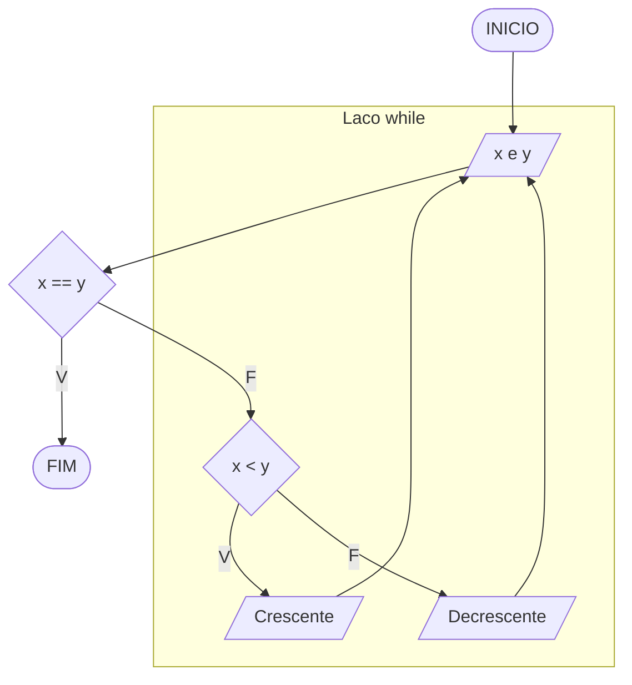

# BEE1113 - Crescente e Decrescente

## Fluxograma

```mermaid
flowchart TD
A([INICIO]) --> B[/"x e y"/]
B --> C{"x == y"}
C -- V --> D([FIM])
C -- F --> E{"x < y"}
subgraph SEQ [Laco while]
E -- V --> F[/"Crescente"/]
E -- F --> G[/"Decrescente"/]
F --> B
G --> B
end
```
