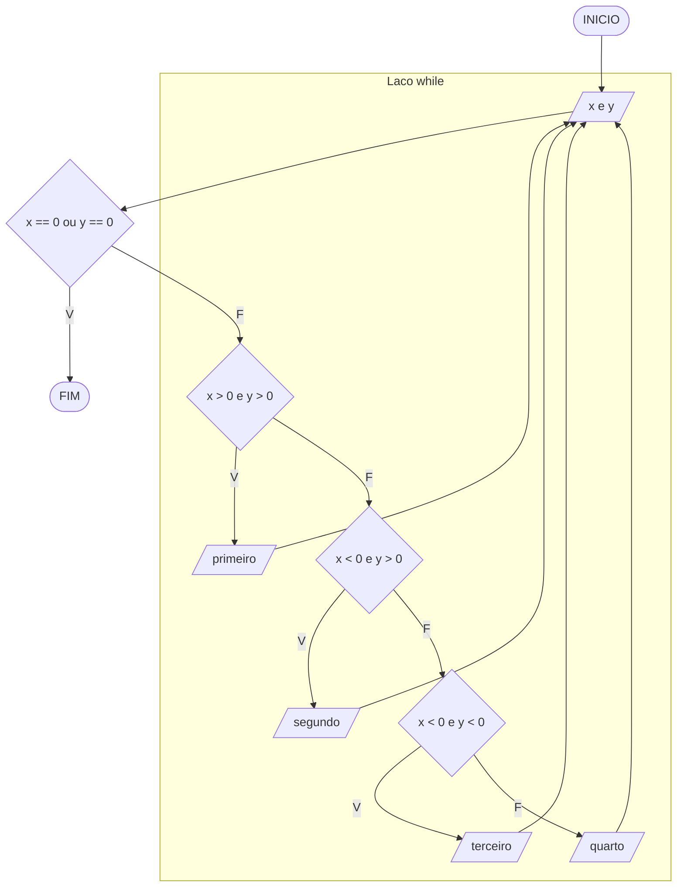

# BEE1115 - Quadrante

## Fluxograma

```mermaid
flowchart TD
A([INICIO]) --> B[/"x e y"/]
B --> C{"x == 0 ou y == 0"}
C -- V --> D([FIM])
C -- F --> E{"x > 0 e y > 0"}
subgraph SEQ [Laco while]
E -- V --> F[/"primeiro"/]
E -- F --> G{"x < 0 e y > 0"}
G -- V --> H[/"segundo"/]
G -- F --> I{"x < 0 e y < 0"}
I -- V --> J[/"terceiro"/]
I -- F --> K[/"quarto"/]
F --> B
H --> B
J --> B
K --> B
end
```
