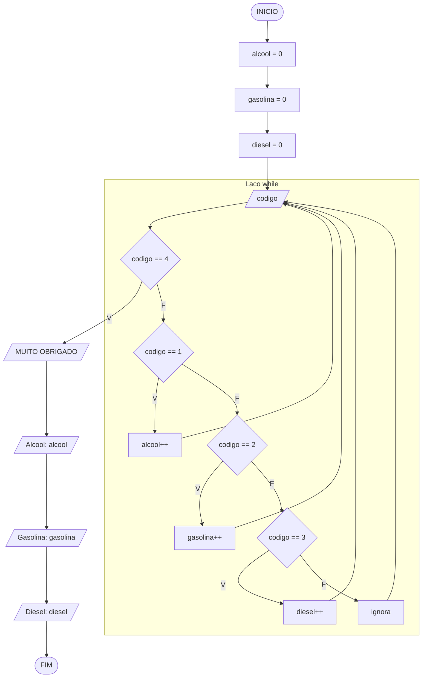

# BEE1134 - Tipo de Combustivel

## Fluxograma

```mermaid
flowchart TD
A([INICIO]) --> B["alcool = 0"]
B --> C["gasolina = 0"]
C --> D["diesel = 0"]
D --> E[/"codigo"/]
E --> F{"codigo == 4"}
F -- V --> G[/"MUITO OBRIGADO"/]
G --> H[/"Alcool: alcool"/]
H --> I[/"Gasolina: gasolina"/]
I --> J[/"Diesel: diesel"/]
J --> K([FIM])
subgraph SEQ [Laco while]
F -- F --> L{"codigo == 1"}
L -- V --> M["alcool++"]
L -- F --> N{"codigo == 2"}
N -- V --> O["gasolina++"]
N -- F --> P{"codigo == 3"}
P -- V --> Q["diesel++"]
P -- F --> R["ignora"]
M --> E
O --> E
Q --> E
R --> E
end
```
