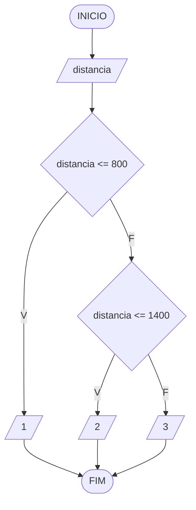

# BEE2780 - Basquete de Robos

## Fluxograma

```mermaid
flowchart TD
A([INICIO]) --> B[/"distancia"/]
B --> C{"distancia <= 800"}
C -- V --> D[/"1"/]
C -- F --> E{"distancia <= 1400"}
E -- V --> F[/"2"/]
E -- F --> G[/"3"/]
D --> H([FIM])
F --> H
G --> H
```
